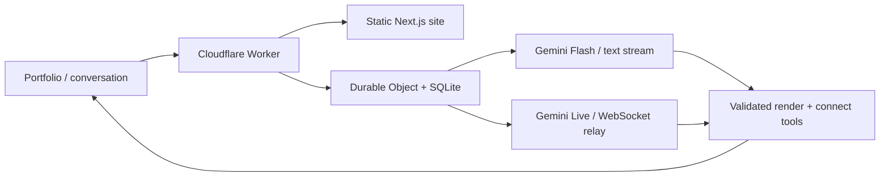

# Iris

**A portfolio you can have a conversation with.**

Iris is the voice and text assistant on [Ayush Bhattacharya’s personal website](https://ayushbh.ayushbh.workers.dev/). Ask about a project, explore his experience, or paste a job description. Iris answers and brings the relevant information onto the screen.

[Live website](https://ayushbh.ayushbh.workers.dev/) · [Architecture & decisions](docs/DECISIONS.md) · [Spend controls](docs/SAFETY.md) · [Deployment guide](docs/LAUNCH.md)


## What makes it interesting

- **Voice and text, one thread.** Gemini Live handles speech; Gemini Flash handles written conversations. Switching modes carries the recent conversation with it.
- **An interface the assistant can use.** Two validated tools, `render` and `connect`, show project details, timelines, skill comparisons and contact actions. The model composes typed UI blocks rather than arbitrary HTML.
- **Awareness of the page.** Opening a project sends a small contextual event to Iris, so she can explain what you are looking at without reopening the page.
- **Useful without the AI.** Three source-reviewed project stories have interactive workflow diagrams and implementation details. The portfolio and CV remain available without starting a paid conversation. See [project evidence](docs/PROJECTS.md).
- **Anonymous access with bounded spend.** Visitor and network limits, Turnstile, budget reservations and a server-owned voice relay govern access. Pause and block controls can end active sessions.
- **An owner’s view.** Transcripts, tool events, usage and visitor messages are available in an authenticated admin viewer. Audio is never stored.

## How it works



The browser never receives a Gemini key. The Worker issues a one-use local voice ticket; the relay owns the model configuration, tools, session deadline and metering. Text calls reserve credit before each model round and record completed usage even when a later round fails.

Iris’s knowledge comes from approved Markdown files. Voice has hidden pronunciation guidance; written names keep their normal spelling. Recent conversation context is carried between modes; saved owner records do not provide returning visitors with long-term memory.

**Stack:** Next.js · React · TypeScript · Gemini · Cloudflare Workers · Durable Objects / SQLite · Zod · Lucide

## Run locally

Use Node.js 26 (see `.nvmrc`), npm and Python 3 for the schema check.

```sh
git clone https://github.com/Ayushbh6/Iris.git
cd Iris
npm ci
npm run dev
```

The portfolio runs at **http://127.0.0.1:3107**. Browsing the site does not require an API key.

To enable real AI locally:

```sh
cp .env.example .env
# Add your GEMINI_API_KEY to .env.
npm run worker:dev:live
# In another terminal:
npm run dev
```

The local API runs on **8787**. Development uses Cloudflare’s published Turnstile test keys and local-only owner credentials. Real model calls incur provider charges. Scripts read `.env.local`, then `.env`, then the original workspace’s `../.env`; `IRIS_ENV_FILE` selects an explicit file.

```sh
npm run rehearse -- --keep  # Same-origin production-style preview on port 8788
```

## Repository guide

| Path                               | Purpose                                                    |
| ---------------------------------- | ---------------------------------------------------------- |
| `app/`, `components/`              | Portfolio, conversation UI and owner viewer                |
| `lib/content.ts`, `lib/explore.ts` | Curated project content and stored views                   |
| `lib/agent/`                       | Prompts, UI schemas, browser audio and conversation state  |
| `knowledge/`                       | Approved facts and assistant policy                        |
| `worker/`                          | API, voice relay, identity, quotas, accounting and records |
| `db/migrations/`                   | Versioned SQLite schema                                    |
| `scripts/`, `tests/`               | Local tooling and verification                             |
| `public/`                          | Published visual assets and CV                             |

After editing `knowledge/*.md`, run `npm run knowledge:build`. The test suite checks that the generated module matches the source.

## Verify

```sh
npm run typecheck
npm run worker:typecheck
npm test
npm run db:check
npm run worker:test
npm run build
```

GitHub Actions runs these checks without production credentials or paid model calls. The separate live suite uses your Gemini key and an isolated local Worker:

```sh
npm run live:test
npm run smoke -- https://ayushbh.ayushbh.workers.dev
```

## Deploy your own

1. Change the Worker name, hostnames and budget settings in `worker/wrangler.prod.jsonc`.
2. Create a Turnstile widget for your hostname and replace the **public** site key in `deploy.config.json`.
3. Authenticate with `npx wrangler login`, then follow [the launch guide](docs/LAUNCH.md) to deploy and configure secrets.
4. Run `npm run deploy` for checks, build, upload and public smoke tests. `npm run deploy -- --dry-run` uploads nothing.

Deployment is manual. CI does not receive production secrets and does not publish the site.

## Privacy and limits

Conversations are saved for the owner for 90 days; messages left through the contact form are kept for a year. Audio is not stored. An essential security cookie preserves browser identity across token renewal. The [privacy page](https://ayushbh.ayushbh.workers.dev/privacy/) explains this to visitors.

Without accounts, one person cannot be reliably identified across devices or networks. Global budget reservations remain the final admission control. Provider usage can arrive after generation, so these controls are not an exact billing-account hard cap. See [the safety runbook](docs/SAFETY.md) for configuration, failure handling and remaining limits.

This repository contains only the website application. Credentials, local databases, conversation recordings, generated test artifacts and private design references are excluded.
